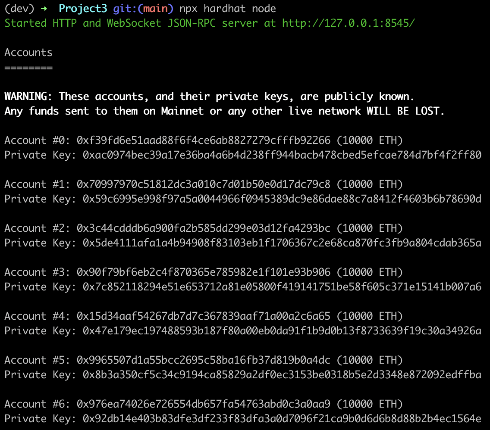
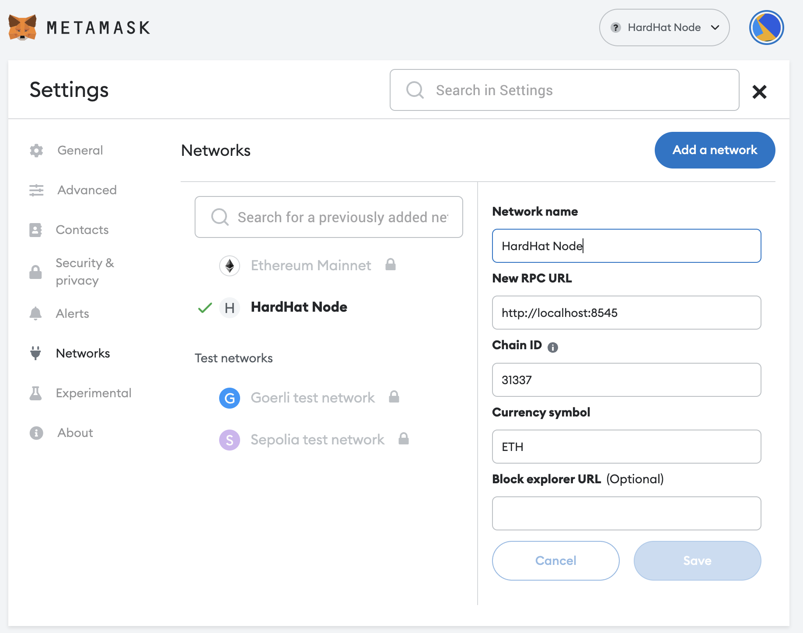
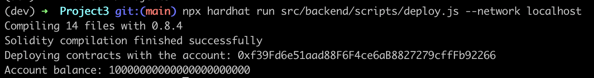
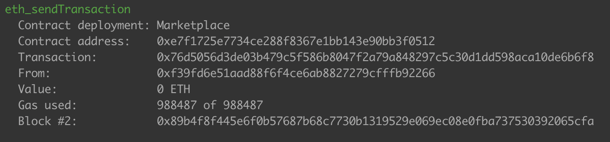
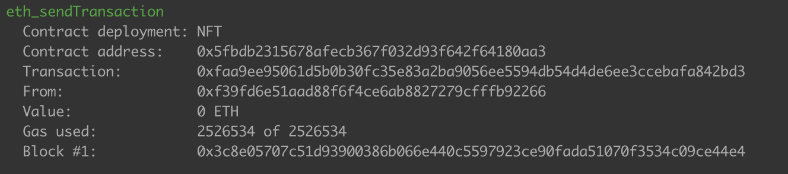
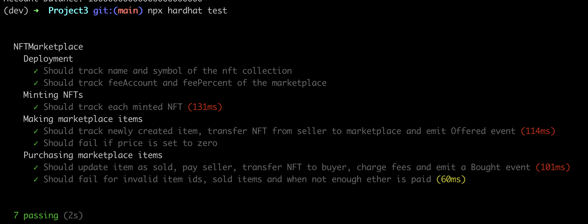

# NFT Marketplace

## Technology Stack & Tools

- [Solidity](https://docs.soliditylang.org/en/v0.8.18/) (Writing Smart Contract)
- Javascript ([React](https://reactjs.org/) & Testing)
- [Ethers](https://docs.ethers.io/v5/) (Blockchain Interaction)
- [Hardhat](https://hardhat.org/) (Development Framework)
- [Ipfs](https://ipfs.io/) (Metadata storage)
- [React routers](https://v5.reactrouter.com/) (Navigational components)

License
----
MIT


## Requirements For Initial Setup
- Install [NodeJS](https://nodejs.org/en/), should work with any node version below 17.5.0
- Install [Hardhat](https://hardhat.org/)

## Setting Up

### 1. Clone/Download the Repository

### 2. Install Dependencies:
```
$ cd Project3
$ npm install
```
### 3. Boot up local development blockchain
```
$ cd Project3
$ npx hardhat node
```



### 4. Connect development blockchain accounts to Metamask

- Copy private key of the addresses and import to Metamask

- Connect your metamask to hardhat blockchain, network 127.0.0.1:8545.
- If you have not added hardhat to the list of networks on your metamask, open up a browser, click the fox icon, then click the top center dropdown button that lists all the available networks then click add networks. A form should pop up. For the "Network Name" field enter "Hardhat". For the "New RPC URL" field enter "http://127.0.0.1:8545". For the chain ID enter **"31337"**. Then click save.  


### 5. Migrate Smart Contracts
```
npx hardhat run src/backend/scripts/deploy.js --network localhost
```







### 6. Run Tests
`$ npx hardhat test`




### 7. Launch Frontend
`$ npm run start`


___

Resources:
* https://support.chainstack.com/hc/en-us/articles/4408642503449-Using-MetaMask-with-a-Hardhat-node
* https://stackoverflow.com/questions/7986139/git-error-when-trying-to-push-pre-receive-hook-declined
* https://community.infura.io/t/ipfs-cors-error/3149
